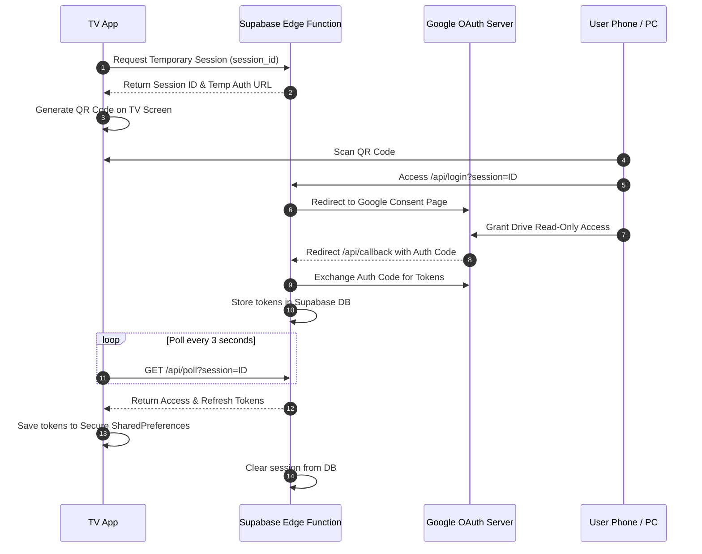

<p align="center">
  
</p>

<h1 align="center">CloudStream TV</h1>

<p align="center">
  <strong>Premium Android TV media streaming — directly from your Google Drive.</strong>
</p>

<p align="center">
  
  
  
  
  
</p>

<p align="center">
  <a href="#-features">Features</a> •
  <a href="#-supported-formats">Formats</a> •
  <a href="#-remote-controls">Remote</a> •
  <a href="#-performance">Performance</a> •
  <a href="#-oauth-flow">OAuth Flow</a> •
  <a href="#-project-structure">Structure</a> •
  <a href="#-installation">Install</a>
</p>

---

CloudStream TV is a **native Android TV / Google TV** app built with **Kotlin** and **Jetpack Compose for TV (Material 3)**. Browse, stream videos, and play photo slideshows directly from Google Drive. Supports both **public folders** (scraper fallback) and **private folders** (secure OAuth 2.0 Device Flow with QR code sign-in).

> [!IMPORTANT]
> **Platform Restriction**: Designed exclusively for **Android TV** and **Google TV** (API 26+). Navigation requires a D-pad remote or keyboard.

---

## ✨ Features

<table>
<tr>
<td width="50%">

### 📺 Video Playback
- ExoPlayer-powered HD/4K streaming
- Play, Pause, Seek, Fast-forward / Rewind
- Aspect ratio controls: **Fit / Fill / Zoom**
- Playback speed selector (0.5× – 2×)
- Resume from last position (auto-saved)
- Proactive token refresh every 45 min — no mid-video interruptions

</td>
<td width="50%">

### 🖼️ Photo Slideshows
- Full-screen animated image viewer
- Auto-advance with configurable intervals (3s / 5s / 10s / 15s)
- Crossfade transitions between slides
- Manual Prev / Next navigation
- Screen-on lock during active slideshow

</td>
</tr>
<tr>
<td width="50%">

### 🔐 Google Sign-In (TV Device Flow)
- No keyboard typing needed — scan QR on phone
- Two OAuth client options for redundancy
- Polling-based token exchange with countdown timer
- Secure token storage in SharedPreferences

</td>
<td width="50%">

### 🏠 Home Screen
- Recently viewed shelf with long-press to remove
- Expandable sidebar: switch folders, add drives, toggle theme
- Dark / Light theme support
- Grid view and List view toggle
- Backdrop art from current folder content

</td>
</tr>
<tr>
<td width="50%">

### 📡 Network Resilience
- Auto-detect internet disconnection
- Non-intrusive recovery dialog with auto-resume
- Retries pending task automatically when connection restores
- OkHttp Authenticator for transparent 401 token refresh

</td>
<td width="50%">

### ⚡ Performance
- R8-minified release APK (~10 MB)
- Hardware-accelerated alpha layers (no off-screen buffer stutter)
- Lazy list key caching (zero unnecessary recompositions)
- 300ms debounced D-pad seek events
- Mutex-protected concurrent token refresh

</td>
</tr>
</table>

---

## 🎬 Supported Formats

### ✅ Video
| Extension | Notes |
|:---|:---|
| `.mp4`, `.m4v` | Most common — recommended |
| `.mkv` | Full container support |
| `.webm` | VP8 / VP9 / AV1 |
| `.avi`, `.mov`, `.wmv` | Legacy formats |
| `.ts`, `.m2ts` | Transport streams |
| `.3gp`, `.flv`, `.ogv`, `.asf`, `.vob` | Extended support |

### ✅ Photo (Slideshow)
`.jpg` · `.jpeg` · `.png` · `.webp` · `.bmp` · `.gif` · `.heic` · `.heif` · `.tiff` · `.svg` · `.ico`

### ❌ Unsupported (Shows Warning)
Documents (`.pdf`, `.docx`, `.xlsx`) · Audio-only (`.mp3`, `.flac`, `.wav`) · Plain text (`.txt`, `.json`)

---

## 🕹️ Remote Controls

| Key | Action |
|:---|:---|
| **D-pad ↑↓←→** | Navigate between folders, files, sidebar, and controls |
| **D-pad Center (Click)** | Open folder · Play video · Toggle overlay |
| **D-pad Center (Hold 500ms)** | Context menu — remove from history / rename folder |
| **Back Button** | Close overlay → collapse sidebar → exit player |
| **Left / Right** (video) | Seek backward / forward by 10 seconds |

---

## ⚡ Performance

### 1. Recomposition Scope Isolation
`PlaybackScreen` reads `currentPosition` inside a dedicated `PlaybackTimeline` child composable via lambda reference — so only the seekbar updates every 250ms, not the entire screen layout.

### 2. Hardware-Accelerated Alpha
Backdrop overlays use `.graphicsLayer { alpha = ... }` instead of `.alpha()` — avoids off-screen compositing buffers and eliminates GPU stutter during scrolling.

### 3. Smart Lazy-List Key Caching
Every `LazyRow` / `LazyVerticalGrid` uses stable `file.id` / `folder.id` keys — Compose recycler never recreates unchanged items during scroll or data updates.

### 4. Thread-Safe Token Refresh
`DriveRepository.getAccessToken()` uses a coroutine `Mutex` with full atomic re-read inside the lock. Concurrent requests share one refresh result — no duplicate API calls.

### 5. Debounced Seek Events
D-pad seek requests are debounced at **300ms** using a `Job`-based cancel/relaunch pattern — prevents `SOURCE_ERROR` crashes from rapid key repeats.

---

## 🔗 Google Drive Setup

### Public Folder (No Sign-In Required)
1. Right-click your folder in Google Drive → **Share**
2. Under **General Access** → change to **"Anyone with the link"** → **Viewer**
3. Copy the share link and paste it in the app

### Private Folder (Google Sign-In)
- Authenticate with the Google account that has access to the folder
- The app uses **Device Flow (QR Code)** — no typing on the TV keyboard

### Accepted Link Formats
```
Full URL:  https://drive.google.com/drive/folders/YOUR_FOLDER_ID
Folder ID: YOUR_FOLDER_ID
```

---

## 🌐 OAuth Flow

The project includes a **Supabase Edge Function** backend (`supabase/functions/auth-bridge/`) that acts as a secure OAuth 2.0 bridge for TV devices.



### Backend Secrets (Supabase CLI)
```bash
supabase secrets set GOOGLE_CLIENT_ID=<your-client-id>
supabase secrets set GOOGLE_CLIENT_SECRET=<your-client-secret>
supabase secrets set GOOGLE_CLIENT_ID_2=<your-client-id-2>
supabase secrets set GOOGLE_CLIENT_SECRET_2=<your-client-secret-2>
```

> [!NOTE]
> The app's `BACKEND_URL` constant in [`GoogleDriveClient.kt`](app/src/main/java/com/cloudstream/tv/network/GoogleDriveClient.kt) must point to your deployed Supabase Edge Function URL.

---

## 📁 Project Structure

```
CloudStream-TV/
├── app/                          # Android TV — Kotlin + Jetpack Compose
│   ├── src/main/java/com/cloudstream/tv/
│   │   ├── MainActivity.kt       # Root navigation controller
│   │   ├── data/
│   │   │   └── DriveRepository.kt        # Token management, SharedPrefs
│   │   ├── network/
│   │   │   ├── GoogleDriveClient.kt      # API + scraper + OAuth client
│   │   │   └── NetworkUtils.kt           # Connectivity helpers
│   │   └── ui/
│   │       ├── screens/
│   │       │   ├── HomeScreen.kt         # Main browse + sidebar
│   │       │   ├── PlaybackScreen.kt     # Video player
│   │       │   ├── SlideshowScreen.kt    # Photo viewer
│   │       │   └── OnboardingScreen.kt   # First-launch setup
│   │       ├── components/
│   │       │   ├── TVComponents.kt       # Reusable D-pad focusable widgets
│   │       │   └── ConnectivityDialog.kt # Network recovery overlay
│   │       └── theme/
│   │           └── Theme.kt              # Material 3 TV theme
│   └── proguard-rules.pro        # R8 keep rules for release builds
├── supabase/                     # Edge Function OAuth bridge
├── website/                      # Landing page & privacy policy
├── assets/                       # Logo and banner graphics
├── app-debug.apk                 # Debug build
└── app-release.apk               # Production build (R8 minified, ~10 MB)
```

---

## 🚀 Installation

### Sideload Pre-built APK
Download `app-release.apk` from the project root and install via:
- **ADB**: `adb install app-release.apk`
- **USB Drive**: Copy to USB → open on TV with a file manager
- **Local Network**: Serve via HTTP and download with TV browser

### Build from Source
```bash
# Clone the repository
git clone https://github.com/Rupam852/CloudStream-TV.git
cd CloudStream-TV

# Build release APK (R8 minified)
./gradlew assembleRelease

# Output: app/build/outputs/apk/release/app-release.apk
```

> [!NOTE]
> Ensure `local.properties` contains your Android SDK path:
> ```
> sdk.dir=C\:\\Users\\YourName\\AppData\\Local\\Android\\Sdk
> ```

---

## 🛠️ Tech Stack

| Layer | Technology |
|:---|:---|
| Language | Kotlin 1.9 |
| UI | Jetpack Compose for TV (Material 3) |
| Video | Media3 ExoPlayer + OkHttp DataSource |
| Image Loading | Coil 2 |
| Networking | OkHttp 4 + Gson |
| Auth Backend | Supabase Edge Functions (Deno / TypeScript) |
| Build | Gradle 8 + R8 Minification |
| Min SDK | API 26 (Android 8.0) |

---

<p align="center">
  Made with ❤️ for Android TV
</p>
