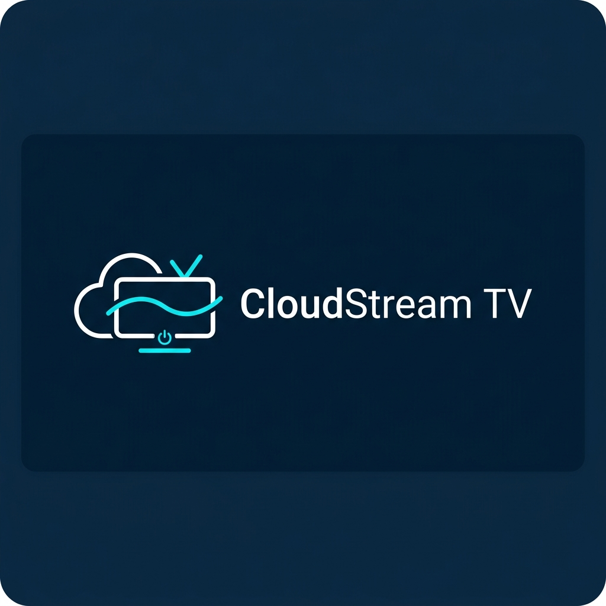
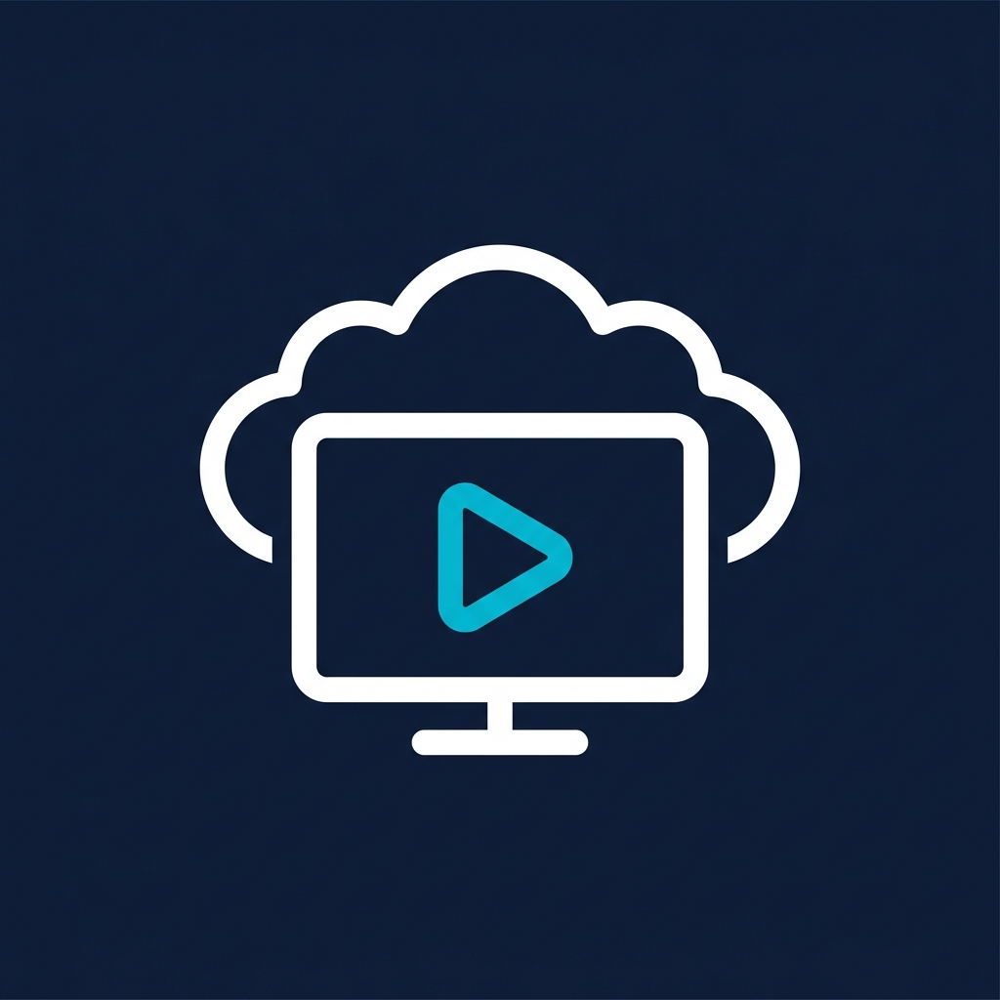
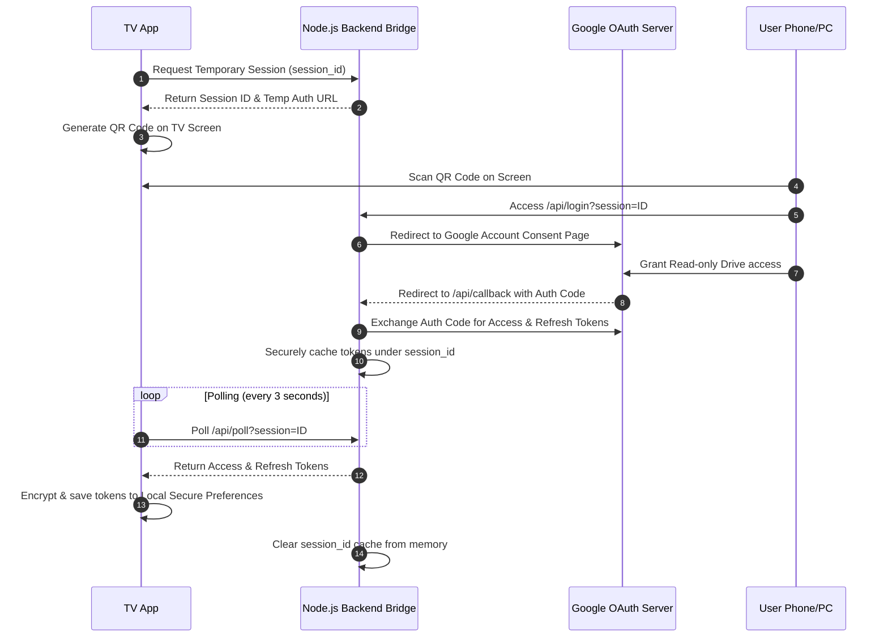

<p align="center">
  
</p>

<p align="center">
  
</p>

<h1 align="center">CloudStream TV</h1>

<p align="center">
  <strong>A premium, native Android TV & Google TV media streaming app designed for Google Drive.</strong>
</p>

<p align="center">
  <a href="#-key-features">Key Features</a> •
  <a href="#-supported-formats">Supported Formats</a> •
  <a href="#%EF%B8%8F-android-tv-remote-controls-mapping">Remote Controls</a> •
  <a href="#-performance-optimizations">Performance Optimizations</a> •
  <a href="#-architecture--oauth-flow">OAuth Flow</a> •
  <a href="#-project-structure">Project Structure</a> •
  <a href="#-installation--build">Installation & Build</a>
</p>

---

CloudStream TV is a native Android TV application built using **Kotlin** and **Jetpack Compose for TV (Material 3)**. It enables users to browse, stream videos, and play photo slideshows directly from Google Drive folders. The app supports public folders using a web scraper fallback, as well as private folders via a secure **OAuth 2.0 Web Auth Bridge** tailored for TV interfaces (scanning a QR code on phone/PC).

> [!IMPORTANT]
> **Platform Restriction**: This application is optimized exclusively for **Android TV** and **Google TV** OS (API 26+). It requires a D-pad remote control or keyboard for optimal navigation.

---

## 📺 Key Features

- **ExoPlayer Video Streaming**: Premium media playback supporting Play/Pause, fast-forward/rewind, aspect ratio scaling (fit/fill/zoom), and playback speed controls.
- **Photo Slideshows**: Beautiful, automated image slideshows with customizable transition intervals (3s, 5s, 10s, 15s) and manual slideshow traversal.
- **Google OAuth 2.0 (Device Flow)**: Secure sign-in designed for TV screens. Displays an activation link alongside a dynamic **QR Code** for quick scanning from a phone or computer.
- **Recents & History**: Seamless shelf showing recently streamed items, with one-press retry and long-press clear history actions.
- **Overlay Sidebar**: Expandable navigation menu for switching between folders, adding new drives, and toggling themes.
- **Touch / Mouse Support**: Full pointer/mouse click support on TV grids, lists, and folders for hybrid devices (e.g. tablet, emulator, projector).

---

## 🚫 Supported Formats

CloudStream TV is strictly optimized for **Video** and **Photo** streaming. Other file formats are not supported.

### ✅ Supported Media Type Streams
*   **Videos**: `.mp4`, `.mkv`, `.webm`, `.m4v`, `.avi`, `.mov`, `.wmv`, `.3gp`, `.ts`, `.m2ts`, `.flv`, `.asf`, `.vob`, `.ogv`
*   **Photos**: `.jpg`, `.jpeg`, `.png`, `.webp`, `.bmp`, `.gif`, `.heic`, `.heif`, `.tiff`, `.svg`, `.ico`

### ❌ Unsupported Formats (Displays Warning Toast)
*   Documents (`.pdf`, `.docx`, `.xlsx`, `.pptx`)
*   Raw text files (`.txt`, `.json`)
*   Audio-only files (`.mp3`, `.wav`, `.flac`, `.m4a`)
*   *Attempting to stream unsupported formats triggers a `"File streaming not supported"` message.*

---

## 🕹️ Android TV Remote Controls Mapping

The app's UI is designed around standard D-pad controllers:

| Remote Key | Action | Detail / Screen Location |
| :--- | :--- | :--- |
| **D-pad Directions** | Navigation | Move focus around grid items, sidebar folders, and playback buttons. |
| **D-pad Center (Enter)** | Select / Click | Open folder, play video, or toggle playback control overlays. |
| **D-pad Center (Long Press)** | Context Menu | **Home Screen**: Remove folder or clear item from Recents/History.<br>**Sidebar**: Remove directory folder shortcut. |
| **Back Button** | Close / Back | Close menus, sidebar, playback controls, or exit the player. |

---

## ⚡ Performance Optimizations

To ensure butter-smooth 60FPS scrolling and playback on budget TV processors (which often have weak CPUs/GPUs), the app incorporates the following low-level Compose TV optimizations:

### 1. Recomposition Scope Isolation (Playback Screen)
*   **Problem**: In Compose, reading state (like ExoPlayer current position) inside a parent container causes the entire layout (including sibling icons, titles, and controls) to recompose every 250ms during video playback.
*   **Solution**: Extracted the seekbar timeline row to a standalone `@Composable PlaybackTimeline` component in [PlaybackScreen.kt](file:///d:/PROJECT/CloudStream%20TV/app/src/main/java/com/cloudstream/tv/ui/screens/PlaybackScreen.kt). The current position is read inside this child component using lambda references (`{ currentPosition }`), localizing recompositions strictly to the seekbar and preventing heavy layout re-evaluations.

### 2. Hardware-Accelerated Alpha Layers (Home Screen)
*   **Problem**: Setting container-level `.alpha()` values forces Android to allocate off-screen buffers to composite the layer, severely degrading GPU rendering and causing scroll stutter.
*   **Solution**: Replaced general `.alpha(alpha)` modifiers with hardware-accelerated `.graphicsLayer { alpha = ... }` rendering for layout backdrops in [HomeScreen.kt](file:///d:/PROJECT/CloudStream%20TV/app/src/main/java/com/cloudstream/tv/ui/screens/HomeScreen.kt).

### 3. Smart Key Caching in Lazy Lists
*   **Problem**: Relying on default index-based keys in `LazyRow` and `LazyVerticalGrid` causes Compose to recreate and redraw elements when items are scrolled or lists are updated.
*   **Solution**: Added unique, persistent keys (such as `file.id` or `folder.id`) to every scroll list in [HomeScreen.kt](file:///d:/PROJECT/CloudStream%20TV/app/src/main/java/com/cloudstream/tv/ui/screens/HomeScreen.kt) and [PlaybackScreen.kt](file:///d:/PROJECT/CloudStream%20TV/app/src/main/java/com/cloudstream/tv/ui/screens/PlaybackScreen.kt) to ensure optimal Compose recycler-view caching.

### 4. Thread-Safe Token Refresh Synchronization
*   **Problem**: When multiple media requests hit the server concurrently with an expired token, multiple concurrent token refreshes would trigger, wasting network overhead and causing potential session invalidation.
*   **Solution**: Implemented a thread-safe coroutine `Mutex` inside `DriveRepository.getAccessToken()` in [DriveRepository.kt](file:///d:/PROJECT/CloudStream%20TV/app/src/main/java/com/cloudstream/tv/data/DriveRepository.kt). Parallel calls wait for a single active refresh process to complete and share the newly refreshed token.

---

## 🔗 Google Drive Folder Link & Access Requirements

### 1. Public Folders (Scraper Mode)
- **Requirement**: The Google Drive folder **must be shared publicly**.
- **Sharing Settings**: Right-click folder in Google Drive -> click **Share** -> under **General Access**, change from *Restricted* to **"Anyone with the link"** and set the role to **"Viewer"**.
- *If not public, the scraper fallback will fail.*

### 2. Private Folders (Google Authenticated Mode)
- **Requirement**: The Google Account authenticated via the QR code/Device flow **must have permission** to view the linked Google Drive folder.

### Accepted Link Formats
You can input either the full sharing link or the folder ID directly:
*   **Full URL**: `https://drive.google.com/drive/folders/1a2b3c4d5e6f7g8h9i0j_k_l_m_n_o_p`
*   **Folder ID**: `1a2b3c4d5e6f7g8h9i0j_k_l_m_n_o_p`

---

## 🌐 Architecture & OAuth Flow

The project includes a lightweight Node.js/Express authorization server in the `backend/` directory. It functions as an authorization bridge to handle Google OAuth 2.0 credentials safely for TV devices.

### Auth Sequence Diagram



### Environment Configuration
To deploy the backend (e.g. to Render, Heroku, or Vercel), configure:
- `GOOGLE_CLIENT_ID`: Google Developer Console OAuth Web Client ID.
- `GOOGLE_CLIENT_SECRET`: Google Developer Console OAuth Web Client Secret.
- `GOOGLE_REDIRECT_URI`: The authorized redirect callback URL (e.g., `https://your-app.onrender.com/api/callback`).

> [!IMPORTANT]
> **Android App Backend Linkage**: If you deploy your custom auth server instance, update the `BACKEND_URL` constant inside [GoogleDriveClient.kt](file:///d:/PROJECT/CloudStream%20TV/app/src/main/java/com/cloudstream/tv/network/GoogleDriveClient.kt#L525) to point to your new backend domain before building.

---

## 📁 Project Structure

```bash
├── app/                  # Android TV Kotlin codebase (Jetpack Compose, Media3)
├── backend/              # Node.js Express OAuth bridge
├── website/              # Frontend landing page & privacy policy
├── assets/               # Banner, logo, and graphic assets
├── app-debug.apk         # Compiled debug APK (local root)
└── app-release.apk       # Compiled optimized production APK (local root)
```

---

## 🚀 Installation & Build

Pre-compiled APKs are ready at the project root:
*   **Release APK**: `app-release.apk` (Optimized production build)
*   **Debug APK**: `app-debug.apk` (Development build)

### Building from Source
Ensure you have the Android SDK path configured in `local.properties`. Run:

```bash
# Clean project and compile both APKs
./gradlew.bat clean assembleRelease assembleDebug
```
